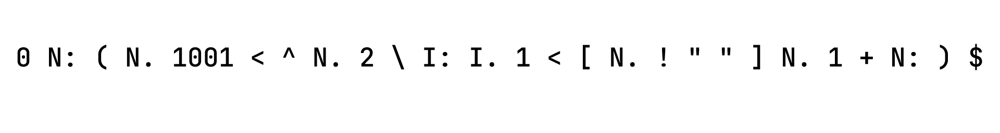

## Mouse-83 Interpreter
Mouse is a small programming language developed by Dr Peter Grogono in the late
70s and early 80s as an extension of an earlier language called MUSYS which was
used to control digital and analogue devices in an electronic studio.  

It was intended to be an efficient and small language for microcomputers which
had limited memory and as such was interpreted. It use a stack-based system and
[Reverse Polish Notation](https://en.wikipedia.org/wiki/Reverse_Polish_notation) to make mathematical calculations.  

Dr Peter designed the interpreter in a way to make as easy as possible to implement
by using symbols that act as operators for various operations. The interpreter
processes a source file as a stream of characters and interprets one character at
a time.  
